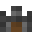

# Dwarf Map Geneator
## Générateur de map aléatoire en pixel
Une fois lancé, appuyez sur `space` pour générer une nouvelle map

Génère les biomes suivant :
- Mer
- Plage
- Plaine
- Forêt
- Montagne
- Glacier
  
Ainsi que des chateaux. &ensp; 
